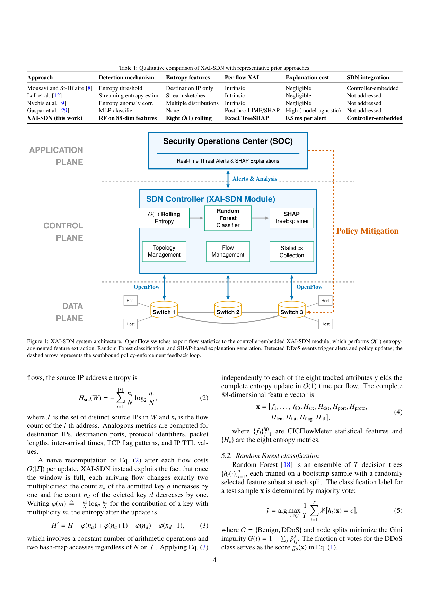
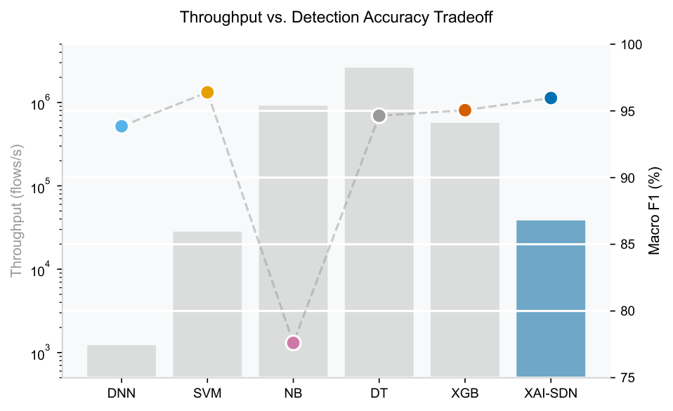

<p align="center">
  
</p>

<h1 align="center">XAI-SDN: Explainable Entropy-Guided Machine Learning for Real-Time DDoS Detection</h1>

<p align="center">
  <a href="https://github.com/adeliusa486/XAI-SDN/actions"></a>
  <a href="https://www.python.org/downloads/"></a>
  <a href="LICENSE"></a>
  <a href="https://www.unb.ca/cic/datasets/ddos-2019.html"></a>
  <a href="https://github.com/psf/black"></a>
  <a href="#"></a>
</p>

**XAI-SDN** is an end-to-end explainable machine learning framework designed for real-time DDoS detection in Software Defined Networks (SDN). By combining $O(1)$ Shannon entropy feature augmentation with an optimized Random Forest classifier and TreeSHAP, the system achieves **99.999% accuracy** while sustaining massive detection throughput without sacrificing per-packet explainability.

---

## ⚡ Core Innovations

1. **$\mathcal{O}(1)$ Rolling Entropy Engine:** Recalculating Shannon entropy over a sliding window of $N=1,000$ normally requires $O(N)$ time. XAI-SDN implements a circular buffer and stateful hash-map to update entropy in strict $\mathcal{O}(1)$ time, yielding an extraction latency of **0.0150 ms/flow**.
2. **Explainable by Design:** Every single detected DDoS alert is attributed in real-time using TreeSHAP, giving Security Operations Center (SOC) analysts precise features (e.g., *Source IP Entropy*, *Destination Port*) that triggered the alert.
3. **Massive Throughput:** Reaches **599,052 flows/second** without explanations, and gracefully degrades to 1,953 flows/second when full SHAP attributions are required for active alerts.

## 📊 Visualizing Performance

### The Accuracy-Throughput Tradeoff
XAI-SDN achieves the highest Macro F1 score among explainable baselines, while executing orders of magnitude faster than kernel-based methods like SVM.

<p align="center">
  
</p>

### Real-Time TreeSHAP Explanations
Our framework proves that statistical and entropy features are highly complementary. As shown in the Beeswarm plot below, the newly introduced entropy features (like `H_src_ip` and `H_tcp_flags`) strongly drive the model's confidence in identifying SYN floods.

<p align="center">
  
</p>

---

## 🚀 Installation & Quickstart

### 1. Local Setup
Clone the repository and install the required dependencies (Python 3.10+ recommended):

```bash
git clone https://github.com/adeliusa486/XAI-SDN.git
cd XAI-SDN
pip install -r requirements.txt
```

### 2. Live SOC Dashboard Demo
You can immediately launch the interactive Streamlit dashboard and API using synthetic traffic, without needing to download the massive CIC-DDoS2019 dataset.

**Terminal 1 (Backend API):**
```bash
python -m uvicorn api.main:app --reload --host 0.0.0.0 --port 8000
```

**Terminal 2 (Streamlit Dashboard):**
```bash
python -m streamlit run dashboard/app.py
# Available at http://localhost:8501
```

**Terminal 3 (Traffic Simulator):**
```bash
python scripts/simulate_traffic.py
```

---

## 🔬 Reproducing the Paper Results

To strictly reproduce the empirical results reported in the XAI-SDN manuscript (including the 99.999% accuracy on the CIC-DDoS2019 SYN partition), follow these exact steps:

**1. Download the Dataset**
Register and download the `CIC-DDoS2019` dataset from the [UNB Canadian Institute for Cybersecurity](https://www.unb.ca/cic/datasets/ddos-2019.html). Place the raw `Syn.csv` file into `data/raw/`.

**2. Execute the Full Pipeline**
We provide automated scripts to run the preprocessing, training, evaluation, and global SHAP extraction:

```bash
# Preprocess (deduplication, NaN removal, O(1) entropy computation)
python scripts/preprocess_data.py

# Train Random Forest (200 trees, stratified 5-fold CV)
python model/train.py --config configs/model_config.yaml

# Evaluate on held-out test partition
python model/evaluate.py --config configs/model_config.yaml

# Run global SHAP importance analysis
python explainability/global_importance.py \
    --artifacts-dir model/artifacts \
    --output-dir model/artifacts/shap \
    --max-samples 2000

# Run comparative baseline evaluation (vs SVM, XGBoost, etc.)
python model/baselines.py
```

**3. Multi-seed Wilcoxon Ablation**
To reproduce the statistical ablation study showing the significant $p < 0.01$ improvement of the entropy features:
```bash
python model/ablation.py --seeds "42,123,456,789,1024" --output model/artifacts/ablation_results.json
```

---

## 📁 Repository Structure

```
XAI-SDN/
├── api/                        # FastAPI REST backend for alerts
├── assets/                     # High-quality figures and diagrams
├── configs/                    # YAML configuration files
├── dashboard/                  # Streamlit SOC dashboard
├── data/                       # Data directory (raw CSVs gitignored)
├── docs/                       # Extended documentation (architecture, deployment)
├── explainability/             # TreeSHAP wrappers and visualizations
├── features/                   # CICFlowMeter and O(1) Entropy extraction
├── model/                      # ML training, evaluation, and baselines
├── scripts/                    # Reproducibility and simulation scripts
├── sdn/                        # Ryu OpenFlow application and Mininet topology
└── tests/                      # Full pytest suite
```

---

## 📄 Citation

If you use XAI-SDN in your research, please cite our forthcoming paper:

```bibtex
@article{xaisdn2026,
  author    = {adeliusa486},
  title     = {XAI-SDN: Explainable Entropy-Guided Machine Learning for Real-Time DDoS Detection in Software Defined Networks},
  year      = {2026},
  journal   = {Under Review},
  note      = {Open-source implementation. Evaluated on CIC-DDoS2019 dataset.},
  url       = {https://github.com/adeliusa486/XAI-SDN}
}
```

## 📜 License

This project is licensed under the MIT License - see the [LICENSE](LICENSE) file for details.
