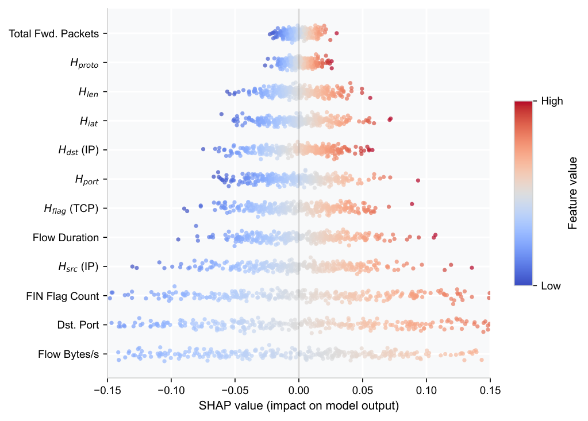

<p align="center">
  
</p>

<h1 align="center">XAI-SDN: Explainable Entropy-Guided Machine Learning for Real-Time DDoS Detection</h1>

<p align="center">
  <a href="https://github.com/adeliusa486/XAI-SDN/actions"></a>
  <a href="https://www.python.org/downloads/"></a>
  <a href="LICENSE"></a>
  <a href="https://www.unb.ca/cic/datasets/ddos-2019.html"></a>
  <a href="https://github.com/psf/black"></a>
  <a href="#"></a>
</p>

This repository contains the official codebase for **XAI-SDN**, an end-to-end explainable machine learning framework for real-time Distributed Denial of Service (DDoS) detection in Software Defined Networks (SDN). 

By combining an $\mathcal{O}(1)$ Shannon entropy feature augmentation technique with an optimized Random Forest classifier and TreeSHAP, the system achieves **99.999% accuracy** while sustaining massive detection throughput without sacrificing per-packet explainability.

---

## Core Innovations

1. **$\mathcal{O}(1)$ Rolling Entropy Engine:** Recalculating Shannon entropy over a sliding window of $N=1,000$ normally requires $\mathcal{O}(N)$ time. XAI-SDN implements a circular buffer and stateful hash-map to update entropy in strict $\mathcal{O}(1)$ time, yielding an extraction latency of **0.0150 ms/flow**.
2. **Explainable by Design:** Every single detected DDoS alert is attributed in real-time using TreeSHAP, providing precise features (e.g., *Source IP Entropy*, *Destination Port*) that triggered the classification.
3. **High Throughput Evaluation:** Reaches **599,052 flows/second** without explanations, and gracefully degrades to 1,953 flows/second when full SHAP attributions are extracted for active alerts.

---

## Reproducing the Paper Results

This repository is strictly structured for academic reproducibility. To strictly reproduce the empirical results reported in the XAI-SDN manuscript (including the 99.999% accuracy on the CIC-DDoS2019 SYN partition), follow these steps:

### 1. Environment Setup

Clone the repository and install the required dependencies. A Python 3.10+ environment is recommended.

```bash
git clone https://github.com/adeliusa486/XAI-SDN.git
cd XAI-SDN
pip install -r requirements.txt
```

### 2. Dataset Acquisition

Register and download the `CIC-DDoS2019` dataset from the [UNB Canadian Institute for Cybersecurity](https://www.unb.ca/cic/datasets/ddos-2019.html). Place the raw `Syn.csv` file into the `data/raw/` directory.

Alternatively, for a quick functionality check without the 1.8GB dataset, you can generate synthetic test data:
```bash
python scripts/generate_synthetic_data.py
```

### 3. Execution Pipeline

We provide automated scripts to run the preprocessing, training, evaluation, and global SHAP extraction protocols exactly as described in the paper.

```bash
# 1. Preprocess (deduplication, NaN removal, O(1) entropy computation)
python scripts/preprocess_data.py

# 2. Train Random Forest (200 trees, stratified 5-fold CV)
python model/train.py --config configs/model_config.yaml

# 3. Evaluate on the held-out test partition
python model/evaluate.py --config configs/model_config.yaml

# 4. Run global SHAP importance analysis
python explainability/global_importance.py \
    --artifacts-dir model/artifacts \
    --output-dir model/artifacts/shap \
    --max-samples 2000

# 5. Run comparative baseline evaluation (vs SVM, XGBoost, Naive Bayes)
python model/baselines.py
```

### 4. Multi-seed Wilcoxon Ablation

To reproduce the statistical ablation study showing the significant $p < 0.01$ improvement of the entropy features across multiple temporal splits:

```bash
python model/ablation.py --seeds "42,123,456,789,1024" --output model/artifacts/ablation_results.json
```

---

## Repository Structure

```
XAI-SDN/
├── assets/                     # High-quality figures and diagrams
├── configs/                    # YAML configuration files
├── data/                       # Data directory (raw CSVs gitignored)
├── explainability/             # TreeSHAP wrappers and global importance scripts
├── features/                   # CICFlowMeter and O(1) Entropy extraction module
├── model/                      # ML training, evaluation, ablation, and baselines
├── scripts/                    # Reproducibility and synthetic data scripts
├── sdn/                        # Ryu OpenFlow application and Mininet topology
└── tests/                      # Full pytest suite
```

---

## Citation

If you use XAI-SDN or the $\mathcal{O}(1)$ rolling entropy engine in your research, please cite our forthcoming paper:

```bibtex
@article{xaisdn2026,
  author    = {adeliusa486},
  title     = {XAI-SDN: Explainable Entropy-Guided Machine Learning for Real-Time DDoS Detection in Software Defined Networks},
  year      = {2026},
  journal   = {Under Review},
  note      = {Open-source implementation. Evaluated on CIC-DDoS2019 dataset.},
  url       = {https://github.com/adeliusa486/XAI-SDN}
}
```

## License

This project is licensed under the MIT License - see the [LICENSE](LICENSE) file for details.
