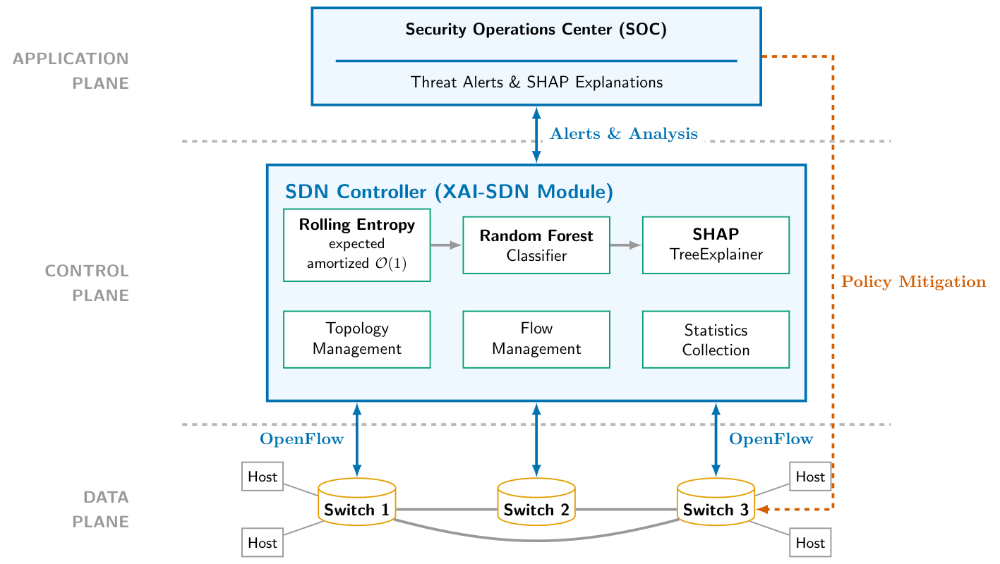
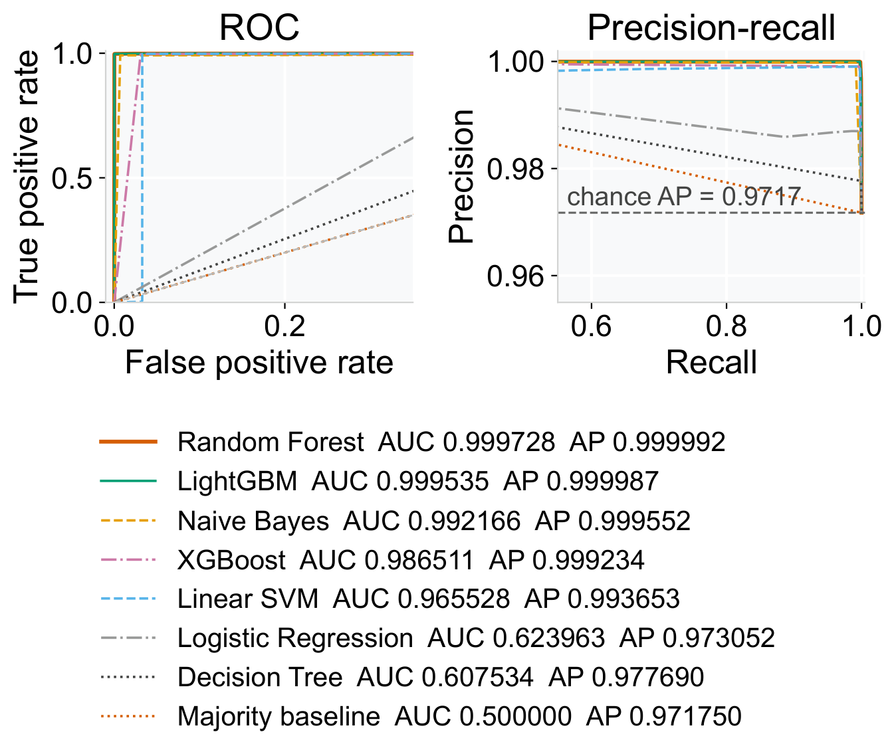
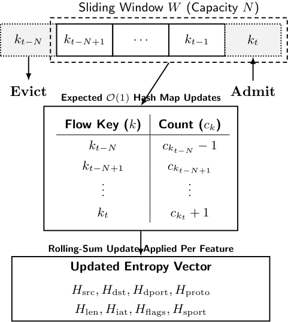
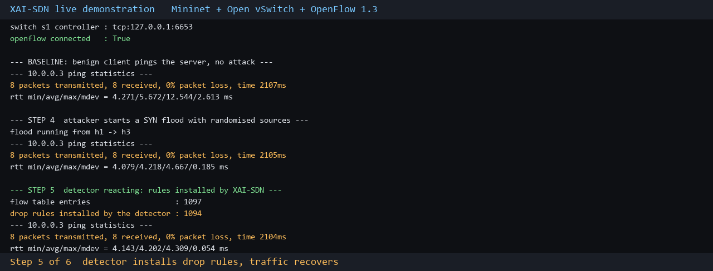

<p align="center">
  
</p>

<h1 align="center">XAI-SDN</h1>

<p align="center">
  <b>Explainable entropy-guided DDoS detection inside the SDN control plane</b>
</p>

<p align="center">
  <a href="https://www.python.org/downloads/"></a>
  <a href="LICENSE"></a>
  <a href="https://www.unb.ca/cic/datasets/ddos-2019.html"></a>
  
  
</p>

---

## Overview

XAI-SDN is a DDoS detector that runs inside an SDN controller process. It augments
the 80 flow statistics a CICFlowMeter-style exporter produces with eight windowed
Shannon entropy features, classifies each flow with a Random Forest, and attaches
an exact TreeSHAP attribution to alerts that an explanation budget admits.

The detector is not the whole contribution. Attributing every alert is what makes
an explainable detector expensive, and running one inside a live control plane is
what makes its cost visible. This repository contains the measurements for both,
including the ones that do not favour the method.

Three properties distinguish the implementation:

- **The entropy engine is streaming.** A circular buffer of flow keys and a hash map
  of key multiplicities update all eight features in expected amortized constant work
  per admit/evict pair, rather than recomputing over the window.
- **The explanation trigger is an explicit admission decision**, not an implicit
  consequence of a positive prediction. Attributing every alert costs a factor of 54
  in throughput; the budget recovers it.
- **Control-plane cost is measured, not assumed.** The detector is run inside a
  controller exchanging real OpenFlow 1.3 messages, and against an emulated network
  under Mininet and Open vSwitch.

---

## Contents

- [Results](#results)
- [Repository layout](#repository-layout)
- [Installation](#installation)
- [Quick start](#quick-start)
- [Reproducing the paper](#reproducing-the-paper)
- [Live SDN testbed](#live-sdn-testbed)
- [What the evidence does and does not support](#what-the-evidence-does-and-does-not-support)
- [Testing](#testing)
- [Citation](#citation)
- [License](#license)

---

## Results

All figures below come from `research/results/` and are produced by the scripts in
`research/experiments/`. Every timing figure was measured on one machine, on the CPU,
under a single harness. The installed PyTorch build carries no CUDA support, so no
model in the comparison can be timed on a GPU even inadvertently.

### Detection, chronological split

Evaluated on the SYN partition of CIC-DDoS2019, ordered by export timestamp, with
every training flow preceding every test flow.

| Metric | Value |
|---|---|
| Accuracy | 99.7579% |
| Macro F1 | 97.8813% |
| ROC-AUC / average precision | 0.999728 / 0.999992 |
| False positive rate | 0.0953% |
| False negative rate | 0.2464% |
| Test flows (benign) | 1,077,238 (30,432) |

### The evaluation protocol dominates the headline number

Identical data, model, hyperparameters and feature definition. Only the partitioning
differs.

| | Stratified random | Chronological |
|---|---:|---:|
| Accuracy (%) | 99.9981 | 99.7538 |
| Macro F1 (%) | 99.9458 | 97.8467 |
| Benign flows in test | 9,304 | 30,432 |
| False positive rate (%) | 0.0000 | 0.1117 |

Benign traffic in this capture is concentrated late in the recording, so a random
split scatters near-identical benign flows across both partitions. Reporting only the
random-split figure would overstate the result by two macro F1 points. Both are
reported here for that reason.

### Against other methods, same data and same hardware

Full chronological split at the corpus's natural class prevalence.

| Method | Accuracy (%) | Macro F1 (%) | FPR (%) | Latency (ms) | Flows/s |
|---|---:|---:|---:|---:|---:|
| Majority baseline | 97.175 | 49.284 | 100.000 | 0.0058 | 63,672,946 |
| Decision Tree | 97.714 | 66.811 | 78.421 | 0.0304 | 11,775,512 |
| Logistic Regression | 98.350 | 80.873 | 51.134 | 0.1086 | 3,236,092 |
| Naive Bayes | 98.590 | 89.590 | 0.700 | 0.1534 | 2,260,331 |
| XGBoost | 99.515 | 95.802 | 3.299 | 0.4168 | 1,260,010 |
| LightGBM | 99.759 | 97.888 | 0.371 | 0.2551 | 764,706 |
| **XAI-SDN (RF)** | 99.758 | 97.881 | **0.095** | 7.0480 | 27,647 |

LightGBM matches the macro F1 at a fraction of the latency. XAI-SDN's advantage is
the false-positive rate, which is roughly four times lower, and the exact attribution
it carries. An operator who values throughput over alert volume should prefer
LightGBM, and the paper says so.

### What explanation costs, and how the budget bounds it

Over a 60,000-flow stream at 99.998% attack prevalence.

| Policy | Explanations | Coverage | Flows/s |
|---|---:|---:|---:|
| Classification only | 0 | n/a | 35,715 |
| Attribute every alert | 59,998 | 1.000 | 661 |
| Episode, per-flow signature | 53,817 | 0.897 | 735 |
| Episode, per-target signature | 38,046 | 0.634 | 1,031 |
| **Episode, per-service signature** | **2** | 0.000 | **35,652** |
| Token bucket, 50/s | 83 | 0.001 | 33,273 |
| Token bucket, 500/s | 839 | 0.014 | 20,505 |

Coverage is the fraction of alerts carrying an attribution computed for that specific
flow. The remainder inherit their episode representative's attribution, which is exact
for the representative and an episode-level summary for the rest. The distinction is
maintained throughout the code and the paper.

### Transfer

| Condition | Target | Macro F1 | FPR | FNR |
|---|---|---:|---:|---:|
| in-distribution | SYN 03-11 | 0.9759 | 0.0092 | 0.0075 |
| zero-shot | LDAP | 0.9692 | 0.0674 | 0.0001 |
| zero-shot | NetBIOS | 0.9566 | 0.0060 | 0.0001 |
| zero-shot | Portmap | 0.9896 | 0.0077 | 0.0009 |
| cross-day | SYN 01-12 | 0.4995 | 0.0112 | 0.0347 |
| zero-shot | InSDN | 0.6026 | 0.0010 | 0.5723 |
| zero-shot | CIC-IDS2017 | 0.2788 | 0.1737 | 0.9813 |

Transfer holds across attack vectors in the same capture and fails across corpora.
A model trained here should not be expected to work on another network without
target-domain labels.

<p align="center">
  
</p>

At 97.17% positive prevalence, ROC curves flatter weak models badly. The decision tree
reaches ROC-AUC 0.6075 while its average precision, 0.9777, is six thousandths above
the 0.9717 a random classifier attains. Only the precision-recall panel shows this.

---

## Repository layout

```
XAI-SDN/
├── features/             rolling entropy engine and the 88-dim feature pipeline
├── model/                training, evaluation, baselines, ablation
├── explainability/       TreeSHAP attribution, global importance, visualisation
├── sdn/                  OpenFlow 1.3 controller application and topology
├── scripts/              data preprocessing and analysis drivers
├── configs/              model, deployment and pipeline configuration
├── tests/                unit tests for the entropy engine, model and pipeline
│
├── research/             everything behind the paper
│   ├── experiments/      one script per experiment (E0 … E23)
│   ├── results/          raw JSON and CSV outputs, never hand-edited
│   ├── figures/          figure sources
│   ├── paper/            manuscript source and compiled PDF
│   ├── data_profiles/    corpus census and schema maps
│   └── logs/             run log and hardware provenance
│
├── supplementary/        consolidated supplementary package (S1 … S7)
└── assets/               images used by this README
```

### The eight entropy features

| Feature | Source attribute | Discretization |
|---|---|---|
| `H_src_ip` | source address | exact |
| `H_dst_ip` | destination address | exact |
| `H_dst_port` | destination port | exact |
| `H_proto` | protocol number | exact |
| `H_pkt_len` | packet length mean | 10 bytes |
| `H_iat` | flow inter-arrival time mean | 1000 µs |
| `H_tcp_flags` | SYN flag count | integer |
| `H_src_port` | source port | exact |

`H_pkt_len` and `H_iat` summarise the diversity of per-flow means, because the mean
is what the flow exporter reports. Source-port entropy is used rather than TTL
entropy: CICFlowMeter exports no TTL column, so a TTL-derived feature is constant on
these records and carries no information.

<p align="center">
  
</p>

---

## Installation

Python 3.11. The analysis experiments run on Windows or Linux. The testbed
experiments need Linux, because Mininet does not run on Windows.

```bash
git clone https://github.com/adeliusa486/xAI-SDN.git
cd xAI-SDN
python -m venv .venv
source .venv/bin/activate        # Windows: .venv\Scripts\activate
pip install -r requirements.txt
```

For the live testbed:

```bash
sudo apt-get install -y mininet openvswitch-switch
```

Exact pinned versions are in `requirements-lock.txt`.

### Data

The corpora are public and are not redistributed here. Point `XAISDN_DATA` at the
directory holding them:

```bash
export XAISDN_DATA=/path/to/data
python research/experiments/common/download_data.py
```

Expected layout:

```
$XAISDN_DATA/
├── CICDDoS2019/03-11/Syn.csv        primary corpus
├── CICDDoS2019/01-12/Syn.csv        second capture day
├── InSDN/Dataset.csv
└── CICIDS2017/
```

The SYN partition holds 4,320,541 exported records and about 16 GB of free memory is
needed to process it.

---

## Quick start

Compute entropy features over a window of flow records:

```python
from features.entropy import EntropyFeatureExtractor, ENTROPY_FEATURE_NAMES

engine = EntropyFeatureExtractor(window_size=1000)

flow = {
    "src_ip": "10.0.0.7", "dst_ip": "10.0.0.3",
    "dst_port": 80, "protocol": 6,
    "pkt_len_mean": 512.0, "iat_mean": 1500.0,
    "tcp_flags": 2, "src_port": 45231,
}

features = engine.update_and_compute(flow)   # adds the flow, returns all eight
print(ENTROPY_FEATURE_NAMES)
print(features)
print(engine.compute_as_array())             # same values, canonical order
```

Train and evaluate under the chronological protocol:

```bash
python -m model.train --config configs/model_config.yaml
python -m model.evaluate --split chronological
```

Explain a single prediction:

```bash
python -m explainability.shap_explainer --flow-id 1042
```

---

## Reproducing the paper

Each experiment writes result files under its own identifier into
`research/results/`, stamped with the host, the library versions and the timestamp,
so any figure can be traced to the build that produced it.

```bash
python research/experiments/e5_leakage_audit.py          # leakage and artifact audit
python research/experiments/e17_entropy_contribution.py  # does the entropy help?
python research/experiments/e10_explanation_budget.py    # explanation throughput frontier
```

To run everything in dependency order:

```bash
python research/experiments/run_queue.py
```

| ID | Experiment | Paper location |
|---|---|---|
| `E0` | Baseline reproduction | Sec. VII-A, Table 6 |
| `E1` | Classical baselines, CPU-only | Sec. VIII-A, Table 19 |
| `E2` | Cross-dataset transfer | Sec. VII-J, Table 12 |
| `E3` | Cross-vector transfer | Sec. VII-J, Table 12 |
| `E4` | Live OpenFlow controller testbed | Sec. VII-R, Table 17 |
| `E4b` | Mininet + Open vSwitch deployment | Sec. VII-P, Table 15 |
| `E5` | Leakage and dataset-artifact audit | Sec. VII-D, Table 8 |
| `E5b` | Duplicate and near-duplicate census | Sec. VII-D1 |
| `E6` | Collinearity, VIF, SHAP stability | Sec. VII-G, Table 11 |
| `E7` | Control-channel offered-rate sweep | Sec. VII-R, Table 17 |
| `E8b` | Flow-table occupancy and TCAM policy | Sec. VII-S, Table 18 |
| `E9` | Deep-learning baselines | Sec. VIII-B, Table 20 |
| `E10` | Explanation budget frontier | Sec. VII-K, Table 13 |
| `E11` | Entropy engine numerical stability | Sec. VII-I |
| `E12` | Threshold selection on the PR plane | Sec. VII-H |
| `E13` | Individual alert case studies | Sec. VII-M, Table 14 |
| `E14` | ROC and precision-recall curves | Sec. VII-N, Fig. 4 |
| `E15` | Nested cross-validation protocol | Sec. VI-B |
| `E16` | Feature-set audit | Sec. VII-C |
| `E17` | Contribution of the entropy augmentation | Sec. VII-F, Table 10 |
| `E18` | Temporal structure of the benign class | Sec. VII-E |
| `E19` | Global SHAP attribution | Sec. VII-L, Fig. 3 |
| `E20` | Few-shot transfer and labeling budget | Sec. VII-J1 |
| `E21` | Entropy under distribution shift | Sec. VII-F1, Table 9 |
| `E22` | Model size / latency Pareto frontier | Sec. VII-Q, Table 16 |
| `E23` | Single-flow latency verification | Sec. VII-Q |

Extended diagnostics, the full testbed configuration and the complete per-run outputs
are in [`supplementary/`](supplementary/), which has its own README mapping every file
to the table or figure it supports.

---

## Live SDN testbed

Two testbeds answer different questions. The first is a control plane without a data
plane: it exchanges genuine OpenFlow 1.3 messages with switch agents over TCP, but no
packet traverses a switch. The second adds a real data plane under Mininet.

```bash
sudo bash research/experiments/common/setup_mininet.sh
sudo python3 research/experiments/e4b_mininet_testbed.py
```

Topology: one Open vSwitch datapath speaking OpenFlow 1.3 to the detector running
inside an os-ken controller process, with three hosts on 100 Mbit links at 1 ms delay
(attacker, benign client, server).

| | No controller | Detection | Detection + explanation |
|---|---:|---:|---:|
| Throughput idle (Mbit/s) | 95.39 | 95.29 | 95.20 |
| Throughput under attack | 25.78 | 95.39 | 95.48 |
| Fraction retained | 0.270 | 1.001 | 1.003 |
| Added packet loss (%) | 0.0 | 0.0 | 0.0 |
| Flow entries / drop rules | 4 / 0 | 999 / 997 | 621 / 619 |
| Packet-ins at controller | 40,160 | 2,335 | 1,788 |
| Controller CPU (% of a core) | 32.5 | 101.0 | 100.9 |
| Controller memory (MB) | 58 | 190 | 255 |
| Decision latency p50 (ms) | n/a | 10.84 | 13.12 |

Without the detector, a SYN flood with randomised sources costs the benign client 73%
of its throughput. With the detector installing drop rules, throughput is retained in
full and no benign packet is lost.

<p align="center">
  
</p>

<p align="center">
  <sub>Recorded walkthrough. Linux <code>tc</code> queue-configuration warnings trimmed; the unedited frames and the full transcript are in <code>supplementary/S2_Mininet_OpenFlow_Testbed/evidence/</code>.</sub>
</p>

The controller-only testbed bounds the ingest rate separately. Across session
configurations a single controller instance absorbed between 34 and 114 novel flows
per second as individual packet-in events. The sweep is saturated at every offered
rate, so it bounds goodput rather than locating a knee. This is two to three orders of
magnitude below the offline feature-extraction rate, and the paper states the range
rather than a ceiling.

---

## What the evidence does and does not support

This section exists because the measurements do not uniformly favour the method.

**The entropy augmentation does not improve in-distribution detection on this corpus.**
The 80 exported flow statistics alone reach 98.28% macro F1 against 97.91% for the full
88-dimensional vector, consistently across five seeds. It does help under distribution
shift wherever all eight features are computable, and a partial entropy vector is worse
than none: on CIC-IDS2017, where only four of the eight can be computed, macro F1 falls
from 0.5658 to 0.2699.

**Dataset artifacts cannot be excluded.** Removing every feature whose single-feature
AUC reaches 0.99 leaves macro F1 unchanged, label permutation collapses to chance, and
scrambling arrival order drops the entropy features' AUCs from 0.99 to 0.56. These
results are inconsistent with several specific artifact mechanisms. They do not
establish that the corpus is free of artifacts, and no experiment on a single synthetic
corpus could.

**The corpus has structural problems worth knowing about.** 11.06% of rows are exact
duplicates. 97.9% of benign flows fall in the final 30% of the capture. 12 of the 80
exported statistics are constant. 99.08% of flows carry one source address, so this
export cannot exhibit the spoofed-source flow-table explosion that source-prefix
aggregation exists to handle.

**The adaptive adversary is out of scope.** The threat model assumes an attacker who
floods but does not optimise against the detector. An adversary who knows the feature
set can rotate spoofed sources to hold per-window entropy near its benign value. What
that evasion costs the attacker has not been measured, and it is the quantity that
would determine whether the defence survives adaptation.

---

## Testing

```bash
pytest tests/ -q
```

39 tests cover the entropy engine, the feature pipeline and the model interface.

---


## License

MIT. See [LICENSE](LICENSE).

The corpora are distributed by their own providers under their own terms:
[CIC-DDoS2019](https://www.unb.ca/cic/datasets/ddos-2019.html),
[CIC-IDS2017](https://www.unb.ca/cic/datasets/ids-2017.html) and
[InSDN](https://aseados.ucd.ie/datasets/SDN/).
